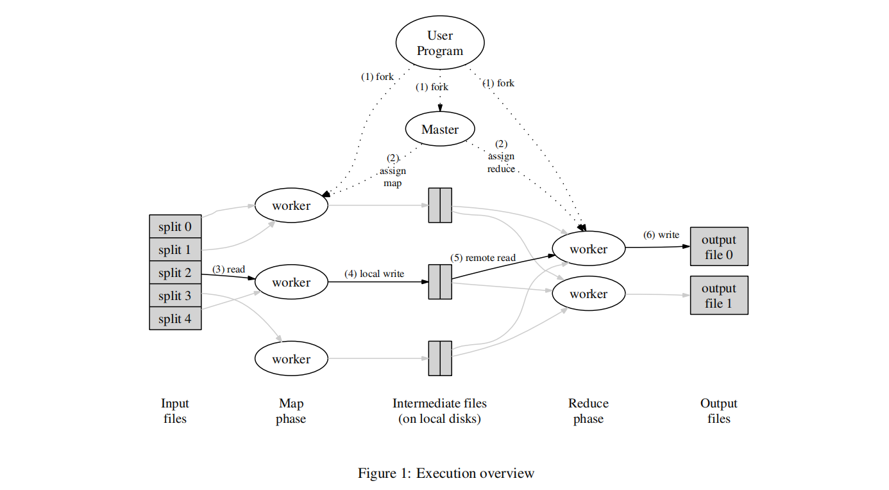

+++
author = "GreyWind"
title = "MapReduce Paper"
date = "2023-08-13"
description = "MapReduce Paper"
categories = [
    "Paper"
]
tags = [
    "MIT-6.824",
]
+++

## Introduction

MapReduce is a programming model mentioned by Google. It runs on a distributed system (like a cluster of commodity machines) and is highly scalable. In addition to the system, there is parallel computing of large-scale data sets.

This paper called [*MapReduce: Simplified Data Processing on Large Clusters*](https://static.googleusercontent.com/media/research.google.com/en//archive/mapreduce-osdi04.pdf) was published in 2004 by Google engineers. Although is just thirteen pages and seems old nowadays, the information in the paper is also meaningful.

## Programming Model

MapReduce is a simple parallel model, in which the user specifies two functions: *Map* and *Reduce*

* Map: takes an input pair and produces a set of *intermediate* key/value pairs.

* Reduce: accepts an intermediate key I and a set of values for that key. It merges together these values to form a possibly smaller set of values.

Consider the problem of counting the number of occurrences of each word in large collections of documents:

```cpp
map(String key, String value):
    // key: document name
    // value: document content
    for each word w in value:
        EmitIntermediate(w, "1")

reduce(String key, Iterator values):
    // key: a word
    // values: a list of counts
    int result = 0;
    for each v in values:
        result += ParseInt(v)
    Emit(AsString(result));
```

## Implementation

The issue of how to make distributed system may face many difficulties, such as parallelising the computation, distributing the data, and handling failures. Using the MapReduce model we can simplify it and implement it in a variety of ways.

### Execution Overview



When the use program calls the *MapReduce* function, it will proceed as follows:

1. The program first split the input files into *M* pieces of typically 16 MB to 64 MB, then starts up many copies of the program.
    
2. One of the copies of the program is special - the master. The rest worker is assigned work by the master. There are M map and R reduce tasks to assign.
    
3. A worker who is assigned a map task reads the contents of the corresponding input split. It parses key/value pairs out of the input data and passes each
    
    pair to the user-defined *Map* function. The intermediate key/value pairs produced by the *Map* function are buffered in memory.
    
4. Periodically, the buffered pairs are written to local disk, partitioned into R regions by the partitioning function. The locations of these buffered pairs on the local disk are passed back to the master, who is responsible for forwarding these locations to the *reduce* workers.
    
5. When a *reduce* worker is notified by the master about these locations, it uses remote procedure calls to read the buffered data from the local disks of the map workers. When a reduce worker has read all intermediate data, it sorts it by the intermediate keys so that all occurrences of the same key are grouped
    
    together. The sorting is needed because typically many different keys map to the same reduce task. If the amount of intermediate data is too large to fit in
    
    memory, an external sort is used.
    
6. The reduce worker iterates over the sorted intermediate data and for each unique intermediate key encountered, it passes the key and the corresponding
    
    set of intermediate values to the user’s *Reduce* function. The output of the *Reduce* function is appended to a final output file for this *reduce* partition.
    
7. When all map tasks and reduce tasks have been completed, the master wakes up the user program. At this point, the MapReduce call in the user program returns back to the user code.
    

After successful completion, the output of the MapReduce execution is available in the *R* output files. Typically, users do not need to combine these R output files into one file because they often pass these files as input to another MapReduce call.

### Fault Tolerance

There is only a single master, its failure is unlikely. We just care about ***worker failure.***

The master pings every worker periodically. If no response is received from a worker in a certain amount of time, the master marks the worker as failed. ***Any*** map tasks ***completed*** by the worker are ***reset back to their initial idle state***, and therefore become eligible for scheduling on other workers. Similarly, any map task or reduce task ***in progress*** on a ***failed*** worker is also reset to *idle* and becomes eligible for rescheduling.

Completed map tasks are ***re-executed*** on a failure because their output is stored on the local disk(s) of the failed machine and is therefore ***inaccessible***. Completed *reduce* tasks do ***not need to*** be ***re-executed*** since their output is stored in a ***global file system***.

When a map task is executed first by `worker A` and then later executed by `worker B` (because A failed), allworkers executing reduce tasks are notified of the re-execution. Any *reduce* task that has not already read the data from `worker A` will read the data from `worker B`.

### Backup Tasks

Sometimes there is a "straggler" lengthen the total time. For example, an aging disk on one machine causes read and write speeds to slow down. In this case, as the MapReduce operation is close to completion, the master schedules backup executions of the remaining in-progress tasks. The task is considered successful if either the original worker or the second assigned worker completes the task.