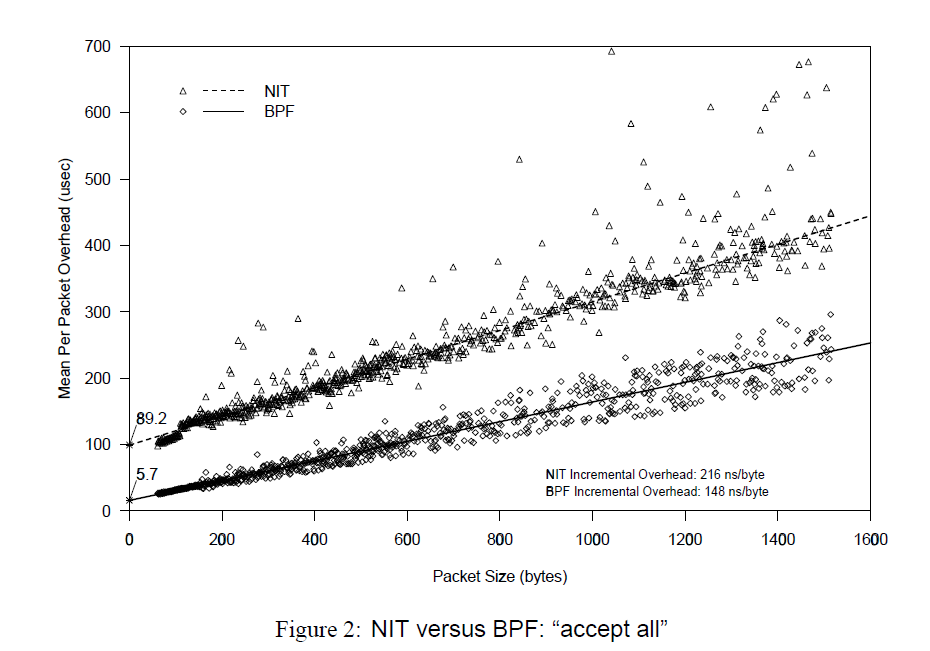
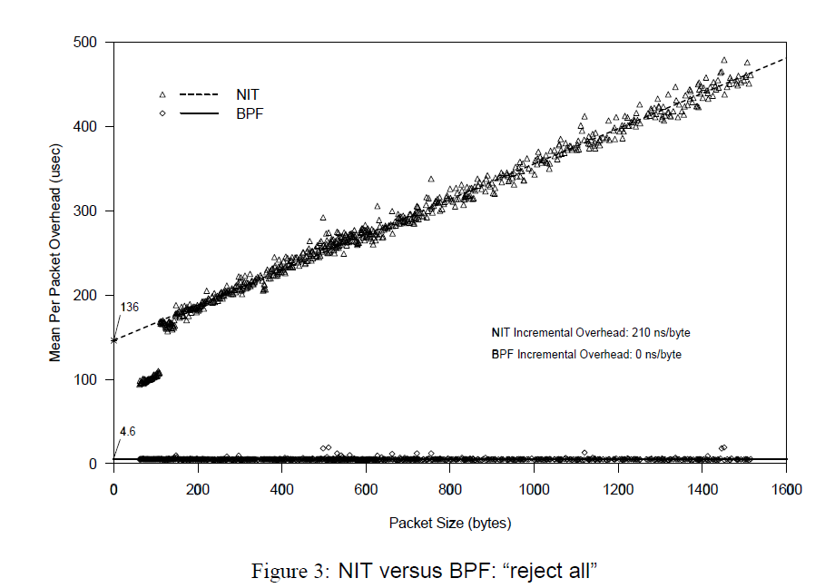
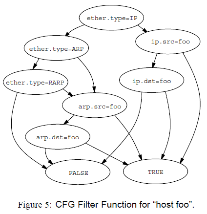

+++
author = "GreyWind"
title = "The BSD Packet Filter (BPF) Paper"
date = "2024-09-17"
description = "The BSD Packet Filter (BPF) Paper"
categories = [
    "Paper",
]
tags = [
    "bpf",
]
+++
## Introduction

[The BSD Packet Filter: A New Architecture for User-level Packet Capture](https://www.tcpdump.org/papers/bpf-usenix93.pdf) Paper is published by UCB in Winter USENIX 1992.

The BPF as known as BSD Packet Filter. It provides a raw interface to data link layers, permitting raw link-layer packets to be send and received, and allow a `user-space` process to supply a filter program that specifies which packets it wants to receive. For example `TCPDUMP`, which directly filters incoming packets in the kernel based on `user-space` rules.

## Architecture

BPF has tow components:

* the network tap (Collect packet)
    
* the packet filter (filter packet by rule)
    

1. When Received Packet, link-level driver will not only send to the protocol stack, but also to the BPF, which will filter it.
    
2. BPF according to different filters, won’t copy it to other buffers in the kernel and then process it. Only after processing the packet, it will copy into a buffer that the user-space can get.
    
3. When processing the packet int BPF, it is not processing one by one. Because the time interval between receiving packets is too short, and the use of the read `syscall` is very laborious. BPF packages the data for analysis, and in order to distinguish this data, BPF adds a layer of header, which is used as the boundary of the data.
    

## Performance

The performance of BPF and NIT (another packet filter) is compared for two extreme cases, in which all packets are received and all packets are rejected.

* X axis is the Packet Size, Y axis is the average process time. When X axis is zero, Y axis value is the overhead of calling filter per packet.
    
* Due to allocate and initialize the buffer, the NIT need `80-100ms`, BPF only need `5ms`
    
* As the packet size increases, it can be seen that when `accepting all packets`, although all packets are copied into the buffer, BPF is faster. When `rejecting all packets`, since BPF directly filters out all packets without any copying, its overhead is almost constant, i.e., the overhead of the filter call.
    

In network monitoring, more information is generally discarded than is needed, so the BPF performance advantage is huge.

## Why BPF faster?

A filter is like an assertion, either true or false, about whether the package is needed filter.

* CSPF uses the **tree structure**, which has the advantage of being simple to implement. However, traversing the tree requires the use of a stack, and every time you push a constant or packet of data into the stack, you need to perform a binary operation between the two elements at the top of the stack. After running through the entire tree structure, the top element of the stack is then read and the packet is only received if it is a non-zero value or the stack is empty, otherwise it is discarded.
    
* Even if you can use the short-circuit operation to optimize the implementation code, there is still a big problem, first of all, **the network is hierarchical, there are many first parts in the packet structure, nested layer by layer, every time you make a judgment to re-disassemble the packet.**
    
* Secondly, the reception is also to **receive a whole packet, without considering that there will be a lot of unwanted data**, which is obviously less efficient than BPF.
    

BPF uses a CFG (Control Flow Graph), which is a DAG (Directed Acyclic Graph).The left branch indicates that the node is false and the right branch indicates that the node is true. **this structure makes more use of registers, which is also a reason for being faster.**

## BPF VM

In order to realize the above functions, BPF has **designed a virtual machine in the kernel**, which uses mostly binary, single-address arithmetic.

It also defines a series of 32-bit arithmetic instructions as follows, but they are implemented as macros, and in the paper they are in assembly form for ease of reading.

Notice that a lot of the addressing operations are relative to packages, since this virtual machine is used to analyze packages.

Since the data is not fixed in the packet, BPF defines an operation to simplify the steps of address operation, i.e., `4\*(\[14\]&0xf)`, which actually **analyzes the IP header**, multiplied by 4 because offset is the unit of word length, which is 4 bytes.