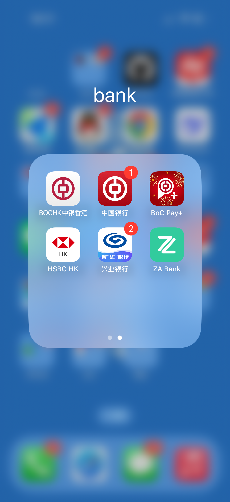
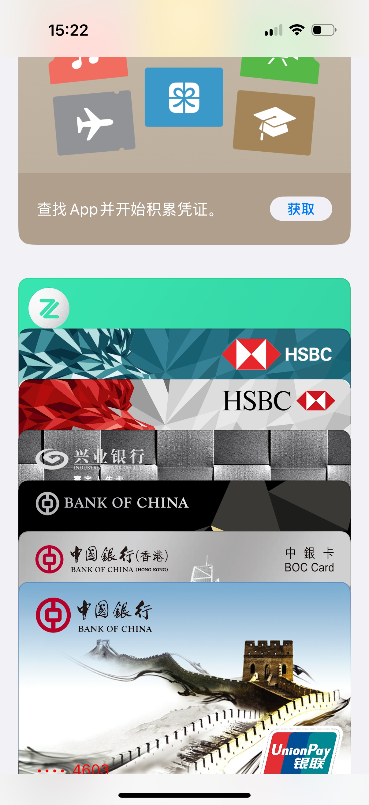
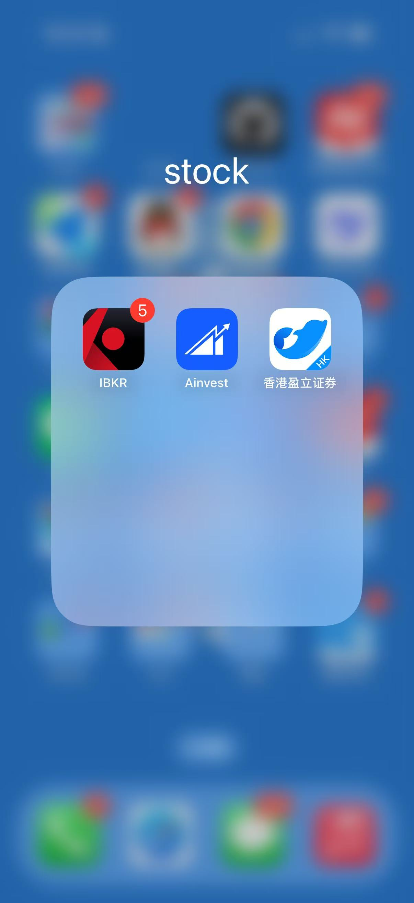

+++
author = "GreyWind"
description = "How to Invest"
date = '2025-03-16T12:22:02+08:00'
modified = '2025-07-19T11:03:02+08:00'
tags = [
  'stock'
]
title = 'How to Invest'
image = "background.png"
+++

## A Beginner's Guide to Overseas Investing

Compared to A-shares, U.S. and Hong Kong stocks offer mature market mechanisms and diverse investment opportunities, making them the best choices for ordinary investors seeking wealth growth.

Notably, for mainland Chinese residents, dividends are taxed at only 10% under WTO agreements, while Hong Kong, Macau, and Taiwan residents face a steep 30% tax. In the U.S., short-term capital gains tax can reach up to 37%, and even long-term investments held over a year may be taxed at 20%. This means U.S. residents may lose nearly half their profits to the IRS. For mainland Chinese residents, this represents a significant advantage.

## Account Opening Requirements

To trade U.S. and Hong Kong stocks, the first step is preparing the necessary accounts and tools. Below are the specific requirements and steps:

### Overseas Bank Account

Investing in overseas securities (e.g., U.S. or Hong Kong stocks) requires an overseas bank account for deposits, trading, and withdrawals.

Additionally, Hong Kong banks offer **fixed deposit interest rates** of 3.5% to 4%, which is also a viable investment option.

For mainland Chinese residents, a Hong Kong bank account is the most convenient choice. As an international financial hub, Hong Kong has an efficient cross-border payment system, supports foreign currency transactions, and is ideal for funding brokerage accounts, receiving dividends, or withdrawing funds.

#### How to Open a Hong Kong Bank Account?

Recommended options include `Bank of China (Hong Kong)` or `HSBC Hong Kong`. Below are their features and application processes:

##### Bank of China (Hong Kong) Account

- **Advantages**: Free transfers from mainland Bank of China to Bank of China (Hong Kong), saving on fees.
- **Requirements**: Strict review for investment-purpose accounts. Prepare the following, or you may be rejected:
  1. **Identification**: ID card, Hong Kong/Macau pass, entry/exit slip.
  2. **Proof of Address** (last three months): Utility bill or credit card statement.
  3. **Proof of Income**: Tax app screenshot or three months of salary records.
  4. **Investment Proof**: A-share account proof and three months of trading records.

##### HSBC Hong Kong Account

- **Advantages**: Lower entry barriers, suitable for beginners.
- **Disadvantages**: Requires pairing with a mainland CIB "Global Life" debit card for discounted foreign exchange and up to 30 fee-free cross-border transfers annually.
- **Requirements**: Only ID card, Hong Kong/Macau pass, and entry/exit slip are needed.

#### Application Steps

1. **Book an Appointment (Optional)**  
   Schedule an appointment on the bank’s website to avoid long wait times.
2. **Prepare Documents**  
   Gather required documents based on the chosen bank’s requirements.
3. **Visit Hong Kong to Open Account**  
   Bring documents to the bank counter; you can usually receive the card on the same day.

#### Notes

- **Foreign Exchange Restrictions**: Mainland Chinese residents have an annual foreign exchange quota of USD 50,000, so plan funds carefully.
- **Exchange Rate Strategy**: Monitor exchange rate trends and convert to USD (for U.S. stocks) or HKD (for Hong Kong stocks) when rates are favorable. Convert in bulk to avoid frequent transactions and extra costs.

### An Apple Device (Optional)

While not mandatory, an Apple device can simplify operations, especially for downloading overseas brokerage apps:

- **U.S. Apple ID**  
   Some overseas brokerage apps are unavailable in the mainland App Store. Register a U.S. Apple ID (preferably in a tax-free state like Alaska) to download required apps.
- **Apple Pay**  
   Link your Hong Kong bank account for centralized fund management. Many e-commerce platforms (e.g., Meituan, JD, but not Alibaba) accept Apple Pay, making daily spending convenient.

## Brokerage Recommendations

Choosing a suitable overseas brokerage is critical. Compare the latest promotions (e.g., commission-free trading or free stocks) before opening an account.

> Due to regulatory restrictions, some brokerages require mainland Chinese residents to provide proof of existing overseas securities accounts, which beginners often cannot meet.
>
> Never forge proof—it’s illegal in Hong Kong and may violate criminal law!

Below are brokerages I’ve used that don’t require proof of existing accounts:

- **U.S. Stock Brokerage**:  
  [InteractiveBrokers](https://www.interactivebrokers.com/)  
  Feature-rich, ideal for experienced investors.
- **Hong Kong Stock Brokerage**:  
  [uSmart](https://www.usmart.hk/zh-hk)  
  User-friendly, perfect for beginners.

- **Market News Platform**:  
  [Ainvest](https://www.ainvest.com/)  
  Can be linked to an InteractiveBrokers account, offers a user-friendly interface and various news updates, and doubles as a great platform for learning English.

## Using a Hong Kong Bank Account in Mainland China

After obtaining a Hong Kong bank account, how can you use it for spending or fund management in mainland China? Here are practical methods:

- **Online Spending**  
   Hong Kong bank cards typically support Visa or Mastercard and can be linked to Alipay or WeChat Pay. Be mindful of exchange rate fluctuations and cross-border fees.
- **In-Person Spending**  
   Bank of China (Hong Kong) and HSBC Hong Kong cards support UnionPay, allowing direct POS transactions in mainland China.
- **ATM Withdrawals**  
   Cash can be withdrawn at UnionPay ATMs, but a HKD 10-20 fee applies per transaction. Minimize withdrawals to reduce costs.
- **Transfers to Mainland China**  
   Transfers from Hong Kong to mainland accounts are subject to the USD 50,000 annual foreign exchange quota (shared with currency conversion).
- **Apple Pay**  
   Link your Hong Kong bank card to Apple Pay for use on supported e-commerce platforms, keeping an eye on exchange rates during payments.

## Risk Warnings

Stock trading is a high-risk investment, especially in the volatile U.S. and Hong Kong markets. Here are some tips and reminders:

- **Market Risks**: U.S. stocks are influenced by U.S. economic and policy changes, while Hong Kong stocks are affected by both mainland and Hong Kong dynamics, leading to potential sharp fluctuations.
- **Knowledge Preparation**: Avoid blindly following trends. Learn fundamental and technical analysis and choose stocks cautiously.
- **Fund Management**: Invest only spare funds, avoiding loans or all-in bets.
- **Mental Preparedness**: The stock market involves gains and losses. Stay rational and avoid emotional decisions.

> **Disclaimer**: This article is for informational purposes only and does not constitute investment advice. The stock market carries risks; invest with caution.
