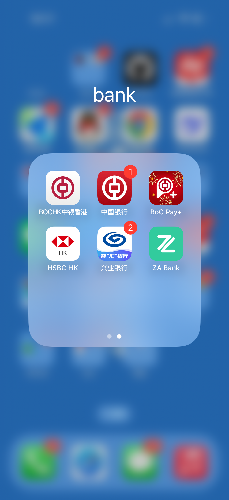
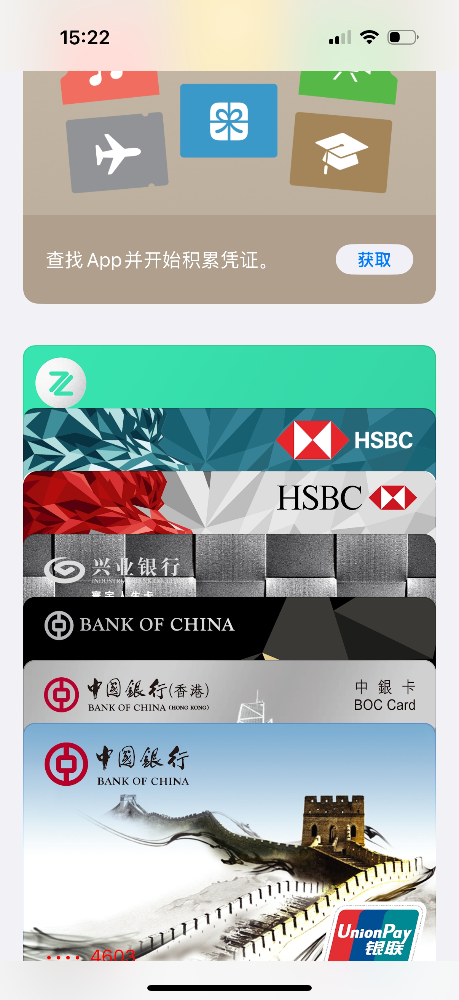
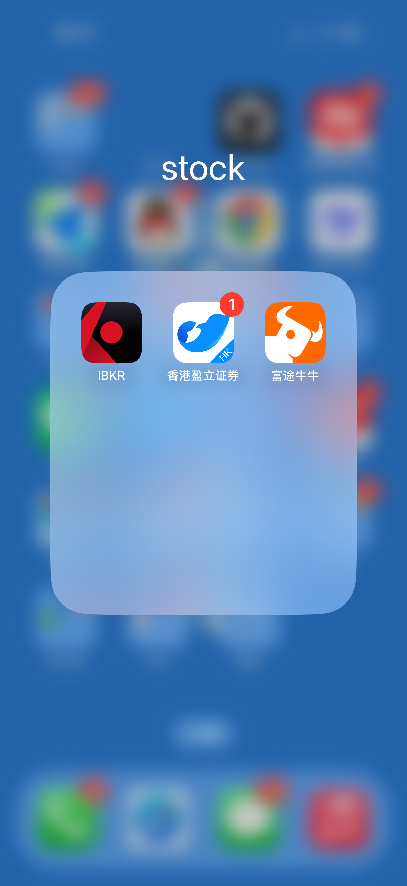

+++
author = "GreyWind"
description = "How to Stock"
date = '2025-03-16T12:22:02+08:00'
tags = [
  'stock'
]
title = 'HowtoStock'
image = "background.png"
+++

## 如何炒美股和港股：从零开始的海外投资指南

随着国内经济环境的变化，许多人开始将投资目光转向海外市场。国内房价低迷，A股表现疲软，优质资产稀缺，而美股和港股凭借成熟的市场机制和丰富的投资机会，逐渐成为普通投资者实现财富增值的新选择。

更值得一提的是，作为中国大陆居民，根据WTO协议，炒美股无需缴纳资本利得税。

而在美国，短线交易的资本利得税最高可达37%，即使是持有超过一年的长线投资，税率也可能高达20%。这意味着，美国居民看似赚了不少，但实际上近一半利润可能要交给税务局（IRS）。对于大陆居民来说，这无疑是一个巨大的优势。

## 开户条件

想要炒美股和港股，第一步是准备好必要的账户和工具。以下是具体要求和操作指南：

### 境外银行卡

投资海外证券（如美股、港股），需要一个境外银行账户用于入金、交易和提取资金。

对于中国大陆居民来说，香港银行卡是最便捷的选择。

香港作为国际金融中心，跨境支付系统高效，支持外币交易，是充值券商账户、接收股息或提现的理想工具。

#### 如何办理香港银行卡？

推荐办理`中银香港`或`汇丰香港`银行卡。以下是两种银行卡的特点和办理流程：

##### 中银香港银行卡

- **优势**：从内地中国银行转账至中银香港免手续费，省下一笔开支。
- **办理要求**：以投资为目的开户审核较严格，需准备以下材料，否则可能被拒：
  1. **身份证明**：身份证、港澳通行证、通关小票。
  2. **地址证明**（近三个月）：水电费账单或信用卡账单。
  3. **收入证明**：个税APP截图或近三个月工资流水。
  4. **投资证明**：A股账户证明及近三个月交易流水。

##### 汇丰香港银行卡

- **优势**：开户门槛较低，适合新手。
- **缺点**：需搭配内地兴业银行“寰宇人生”借记卡，购汇有优惠，每年可享受30笔免手续费跨境汇款。
- **办理要求**：仅需身份证、港澳通行证和通关小票即可。

#### 办理步骤

1. **预约开户（可选）**  
   建议提前在银行官网预约，避免现场排队耗时。
2. **准备材料**  
   根据所选银行要求，提前备齐证明文件。
3. **前往香港办理**  
   携带材料到柜台完成开户，通常当天即可拿到银行卡。

#### 注意事项

- **外汇管制**：中国大陆居民每年有5万美元的外汇兑换额度，需合理规划资金。
- **汇率选择**：关注汇率走势，在汇率有利时兑换美元（炒美股）或港币（炒港股），尽量一次性换汇，避免频繁操作增加成本。

### 一台苹果设备（非必须）

虽然不是必需品，但苹果设备可以让操作更方便，尤其是在下载海外券商软件时：

- **美区账号**  
  国内App Store无法下载部分境外券商软件，需注册一个美区Apple ID（建议选择免税州，如阿拉斯加州）。注册后即可下载所需应用。
- **Apple Pay**  
  可绑定香港银行卡，统一管理资金。许多电商平台（如美团、京东，但阿里系暂不支持）也接受Apple Pay支付，方便日常消费。

## 券商推荐

选择一家合适的境外券商是投资的关键。开户前建议对比最新优惠活动（如免佣金或赠股）。
> 由于政策限制，部分券商要求中国大陆居民提供存量证明（即已有境外证劵公司开户证明），新手往往难以满足这类条件。
>
> 切勿伪造证明——在香港这是违法行为，可能触犯刑法！

以下是我使用且无需存量证明的券商推荐：

- **美股券商**：  
  [盈透证券](https://www.interactivebrokers.com/)  
  功能强大，适合有一定经验的投资者。
- **港股券商**：  
  [盈立证券](https://www.usmart.hk/zh-hk)  
  操作简单，适合新手入门。

## 如何在中国大陆使用香港银行卡

拿到香港银行卡后，如何在内地消费或管理资金？以下是几种实用方法：

- **线上消费**  
  香港银行卡通常支持Visa或Mastercard，可绑定支付宝、微信支付。但需留意汇率波动和跨境手续费。
- **线下消费**  
  中银香港和汇丰香港的银行卡支持银联，可直接在内地POS机刷卡消费。
- **ATM取现**  
  在带有银联标志的ATM机上可取现金，但每次收取10-20港币手续费，建议尽量减少取现频率。
- **转账回内地**  
  从香港账户转账至内地受外汇管制，年度额度为5万美元（与兑换外汇共享额度）。
- **Apple Pay**  
  绑定香港银行卡后，可在支持Apple Pay的电商平台消费，支付时注意汇率即可。

## 风险提示

炒股是一项高风险投资，尤其在美股和港股市场，波动性更大。以下是几点建议和提醒：

- **市场风险**：美股受美国经济和政策影响，港股则受内地和香港局势双重牵制，可能出现剧烈波动。
- **知识储备**：不要盲目跟风，建议学习股票基本面和技术面分析，谨慎选股。
- **资金管理**：只用闲钱投资，避免借贷炒股或孤注一掷。
- **心理准备**：股市有赚有亏，保持理性，避免被情绪左右。

> **免责声明**：本文仅为信息分享，不构成投资建议。股市有风险，入市需谨慎。
