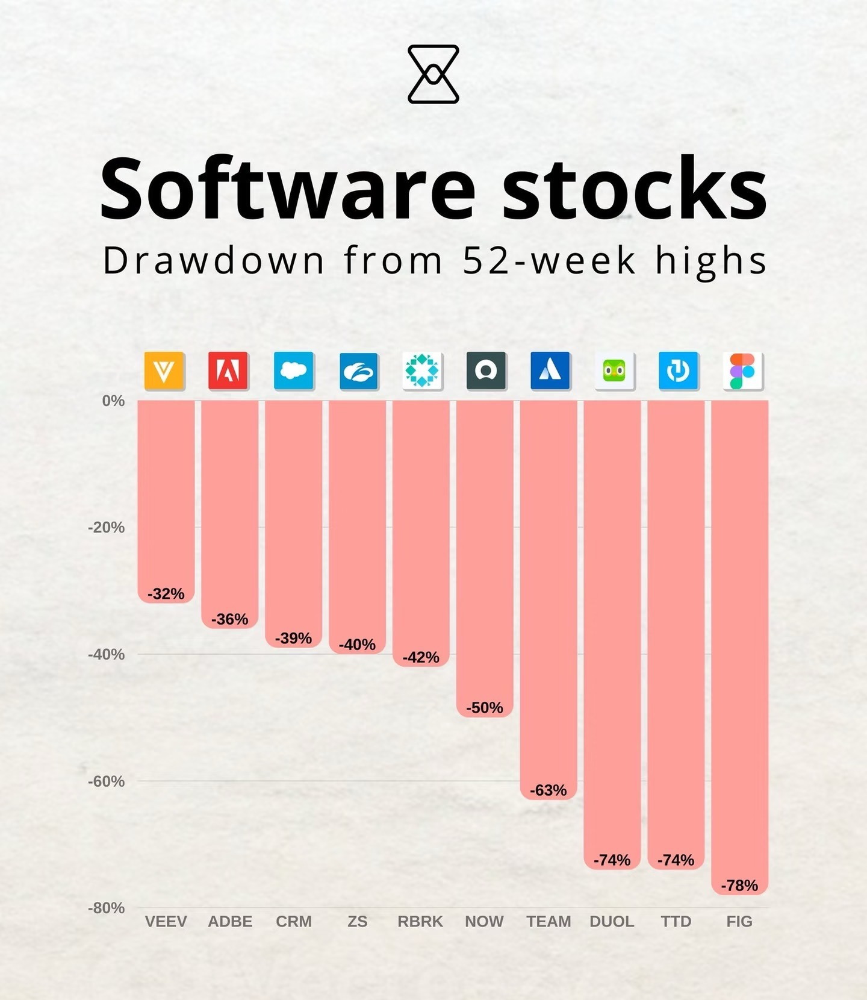
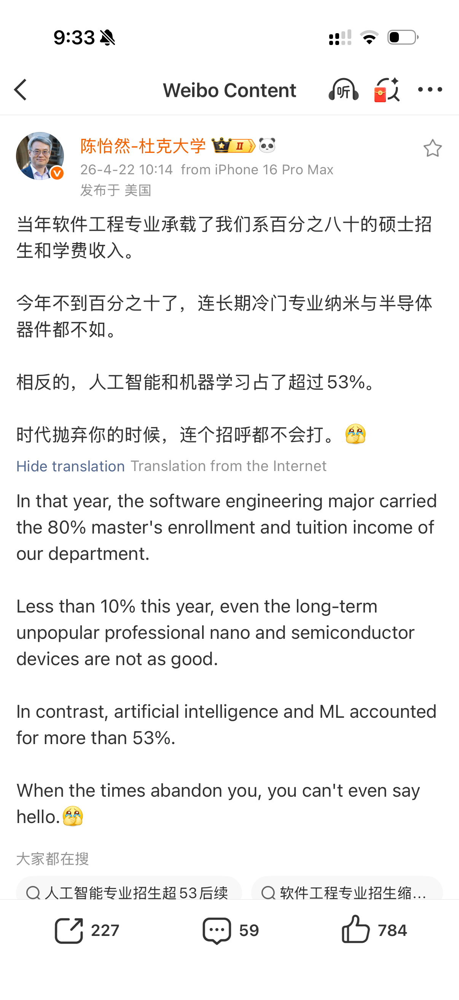
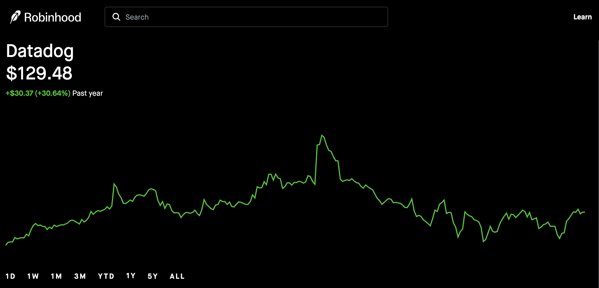
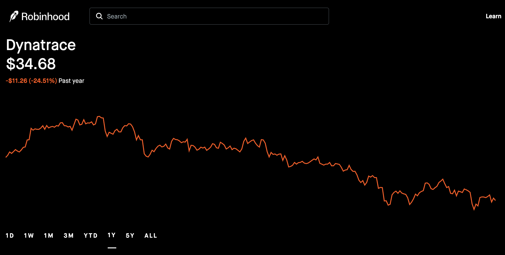
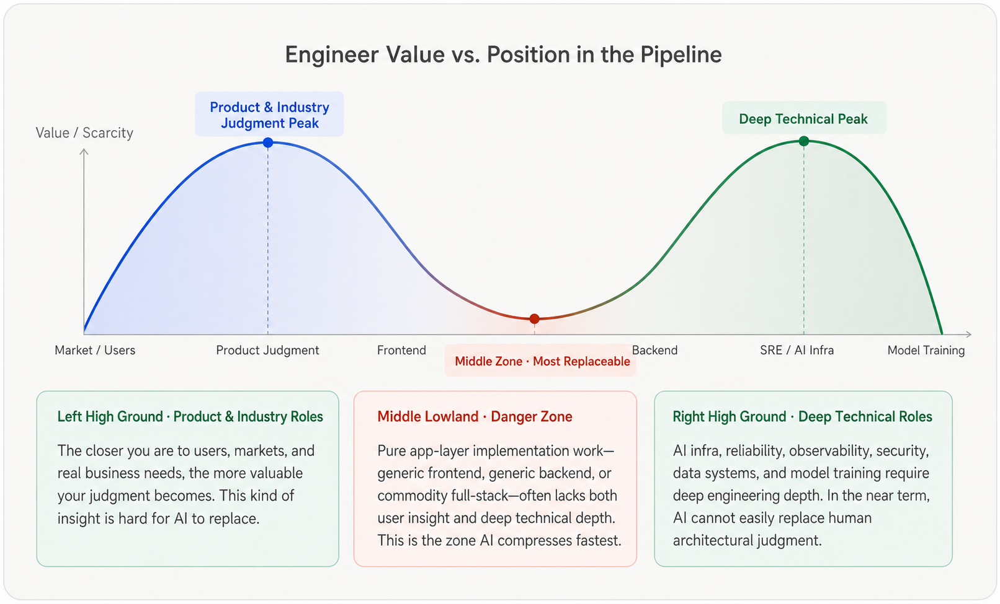
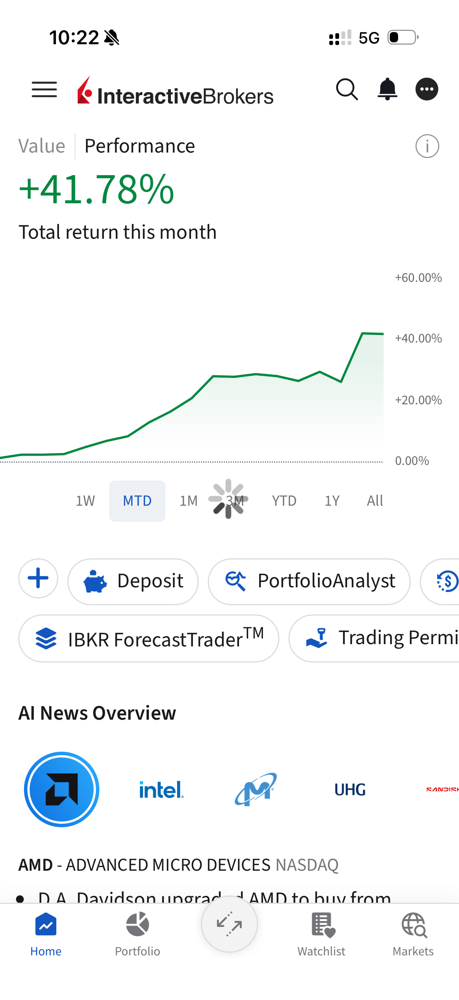

+++
author = "GreyWind"
description = "A practitioner's view on the repricing of SaaS companies as AI compresses software delivery costs and reshapes traditional moats."
date = '2026-04-26T10:42:02+08:00'
modified = '2026-04-26T11:03:02+08:00'
tags = [
  'stock', 'SaaS', 'AI', 'Observability'
]
title = 'Revaluing SaaS: A Practitioner’s Perspective'
image = 'background.png'
+++

> **Disclaimer:** Personal views only; does not constitute investment advice. Parts of this article were synthesized with AI assistance.

I originally considered more provocative titles, such as "The Slow Death of SaaS" or "The End of the SaaS Buildout Cycle." However, those felt too absolute.

A more precise assessment is this: **SaaS is not dying, but its valuation logic, sources of moat, and the required skill set for practitioners are being repriced by AI.**

By mid-2026, the AI narrative is self-evident. This article explores the reality of this industry-wide "repricing" from a software practitioner’s lens, applying analytical frameworks borrowed from finance.

---

## The Macro Signals: Markets, Enterprises, and Education

### Capital Markets: Reassessing the Design Moat

With the advent of [*Claude Design*](https://www.anthropic.com/news/claude-design-anthropic-labs) and *ChatGPT Images 2.0*, the market has begun to re-evaluate the defensive moats of creative and design software. This sentiment manifested in sharp sell-offs for Adobe and Figma.

The pressure has also extended to the broader software sector. On April 23, 2026, [the IGV Software ETF fell 5.8%](https://www.marketwatch.com/livecoverage/s-p-500-nasdaq-dow-jones-record-highs-close-donald-trump-cease-fire-iran-war-no-timeline/card/software-stocks-plummet-on-thursday-ending-an-8-day-winning-streak-for-igv-etf-BiPWEntZIWtWSEn50URW) in a single day, bringing its year-to-date decline to roughly 20.9%. While some software stocks may have been unfairly punished, the underlying signal is clear: the era of enjoying premium valuations based solely on recurring revenue is over.

### Enterprises: Leaner Organizations, Higher Talent Density

Tech giants are aggressively streamlining. Recent reports suggest that [Meta has planned cuts of around 8,000 roles, roughly 10% of its workforce](https://www.barrons.com/articles/meta-stock-memo-job-cuts-eb49df09), while Microsoft has offered voluntary buyouts to nearly 9,000 US employees.

While AI isn't the *sole* driver, it provides a powerful catalyst for organizational restructuring. Companies are pursuing a "higher-density" model: fewer people, higher per-capita output, and concentrated budgets shifted toward AI infrastructure and core product innovation.

### Education: A Cooling Talent Pipeline

Enrollment in CS/SE programs in the US is starting to plateau or retreat. Reports indicate an 8% drop in CS majors last fall. As noted by Professor Chen at Duke University, software engineering once absorbed a large share of enrollment demand and tuition revenue. Now, in some cases, it no longer looks like the default path for top students. The market is beginning to question the long-term ROI of traditional software roles.

---

## The Practitioner’s Reality: From Complexity to Commodity

In conversations with fellow developers, a consistent theme emerges: the “learning tax” is shrinking. In the past, mastering an unfamiliar domain required a meaningful investment of time. Today, tools like *Claude Code* and *Codex* can compress that timeline dramatically.

As a practitioner in **DevOps and Observability**, I see this firsthand. Historically, building a robust telemetry system across logs, metrics, and traces was a high-cost, high-complexity endeavor requiring specialized experts. This complexity helped create the historical pricing power and valuation premium enjoyed by companies such as [**Datadog (DDOG)**](https://robinhood.com/us/en/stocks/ddog/) and [**Dynatrace (DT)**](https://robinhood.com/us/en/stocks/dt/).

**The shift is now palpable:**

* **The Commodity:** AI can now bootstrap a basic observability stack—dashboards, alerting rules, and query logic—in a single day. Basic collection, dashboards, alerting, and query experiences will be further commoditized by open-source tools, AI assistants, and cloud providers.
* **The New Value:** The "expert premium" derived from mere implementation is evaporating. Future value is migrating toward **production-grade reliability, data governance, cost control, complex RCA (Root Cause Analysis), permission auditing, and LLM/Agent Observability.**

Traditional monitoring companies must pivot from "data collection platforms" to "AI-era Reliability Platforms." If they make that transition successfully, they can survive the repricing. If "LLM Observability" becomes merely a new label rather than a real product transition, their valuations may remain under pressure.

To be clear, this does not mean I believe Datadog or Dynatrace are losing their value. Datadog’s recent results remain strong, and both companies are already moving toward LLM Observability and AI SRE. Personally, I still have a positive view of DDOG/DT and hope they can navigate this transition. Some of the sell-off may be excessive, but the repricing itself is real.

In a more extreme scenario, if OpenAI or Anthropic eventually offer native infrastructure for agent tracking, debugging, and reliability, incumbents like DDOG/DT could face additional pressure, similar to what Adobe and Figma are now experiencing in the design-tool market.

---

## What Is Actually Being Repriced?

Charlie Munger often emphasized the value of inversion: when a problem is hard to solve directly, think about it backward.

Applied to SaaS, the question is not only “which software companies will benefit from AI?” but also “if AI keeps compressing software delivery costs, which SaaS moats will disappear first?”

Warren Buffett made a related point in [Berkshire Hathaway’s 1996 shareholder letter](https://www.berkshirehathaway.com/letters/1996.html). Berkshire, he wrote, looks for businesses that are highly likely to possess enormous competitive strength ten or twenty years from now. A fast-changing industry may offer the chance for huge wins, but it also reduces the certainty Buffett seeks.

That lens is especially relevant to software today.

AI is eroding the moats built on "delivery capacity," "feature bloat," and "implementation complexity." The market is now asking a difficult question: **Which companies possess a genuine structural moat that can still exist ten or twenty years from now, and which were merely beneficiaries of high engineering costs?**

The real test is no longer whether a SaaS company can ship features, but whether its moat can survive a world where feature production itself becomes dramatically cheaper.

In an era where AI agents write code, deploy services, call tools, and operate production systems, the enterprise's needs will shift from "how to build" to:

* **Traceability:** What did the agent do, and why?
* **Accountability:** Where is the chain of responsibility when a system fails?
* **Recovery:** How do we roll back an agent-driven error?

SaaS companies lacking a data, distribution, or ecosystem moat are seeing their valuation multiples compressed because their core product—"engineering effort packaged as software"—is becoming significantly cheaper to produce.

---

## Advice for Practitioners: Go Deeper or Go Wider

My advice to fellow engineers, and to myself, is not to "flee" software, but to **exit low-moat roles.**

Pure application-layer CRUD, basic dashboards, and "thin-wrapper" SaaS roles will become hyper-competitive and low-margin. Instead, value will concentrate in two polarities:

1. **Go Deeper (Infrastructure & Reliability):** AI Infra, Reliability Engineering, Security, Data Governance, Agent Runtimes, AI SRE, and Observability. As AI agents become more autonomous, the "guardrails" and "runtimes" they inhabit become more critical.

2. **Go Wider (Business & Industry Context):** Solving high-stakes problems in "deep water" industries like Finance, Energy, Power, and Industrial Manufacturing. These sectors do not need less software. They need software talent that understands risk, business logic, system complexity, and regulatory responsibility—things AI cannot yet "own."

### Personal Pivot

I am no longer defining myself as a "Traditional Software Engineer." I see myself as an **AI-era Software Reliability and Runtime Infrastructure Engineer.**

Furthermore, I have begun applying software engineering methodologies—data automation, systematic risk control, and post-mortem analysis—to the **Financial Sector**. The early results have been encouraging, but this does not mean finance is suitable for every software practitioner, nor should it be read as investment advice. It simply reinforces my belief that "Software Thinking" is a highly portable and valuable asset, provided it is applied to domains with higher barriers to entry and greater responsibility.

In that sense, "moving into other industries" does not mean abandoning software. It means bringing software capability into deeper, higher-responsibility domains that are harder to replace with simple AI tools.

---

## Conclusion

SaaS is not over. Software is not over.

What *is* over is the era where engineering scarcity, feature accumulation, and implementation friction alone could sustain high valuations. AI will make "average" software cheaper, but it will make **truly reliable, production-deep, and responsible software** more valuable than ever.

My only advantage is my youth. Since the industry is being repriced, I must also revalue myself.
